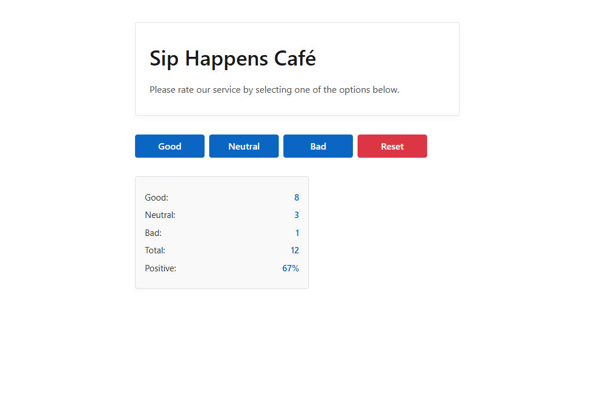

# ☕ React Cafe Feedback Widget

<p align="center">
  
  
  
</p>

A simple React application for collecting feedback about a café.

Users can leave a **good**, **neutral**, or **bad** review and instantly see live statistics.




---

## 🔗 Live Demo

👉 [View live demo on Vercel](https://02-react-cafe-six-beta.vercel.app)

👉 [GitHub repository](https://github.com/SerhiiRepinskyi/02-react-cafe)

---

## ✨ Features

- Feedback voting with three options: **Good / Neutral / Bad**
- Statistics calculation:
  - total number of votes
  - percentage of positive feedback
- Conditional rendering:
  - `No feedback yet` message when there are no votes
- **Reset** button appears only when at least one vote exists
- Clean and strict **TypeScript** typing
- No console errors or warnings

---

## 🛠 Tech Stack

- **React**
- **TypeScript**
- **Vite**
- **CSS Modules**
- **modern-normalize**
- **Prettier**
- **Vercel** (deployment)

---

## 📁 Project Structure

```text
src/
├── components/
│   ├── App/
│   ├── CafeInfo/
│   ├── VoteOptions/
│   ├── VoteStats/
│   └── Notification/
│
├── types/
│   └── votes.ts
│
├── global.css
└── main.tsx
```

- Each component has its own folder with: `.tsx` + `.module.css`
- Components are exported using export default `export default`
- Shared TypeScript types are located in в `src/types`

---

## 🚀 Getting Started

Clone the repository and run the project locally:

```bash
npm install
npm run dev
```

The app will be available at:

```
http://localhost:5173
```
